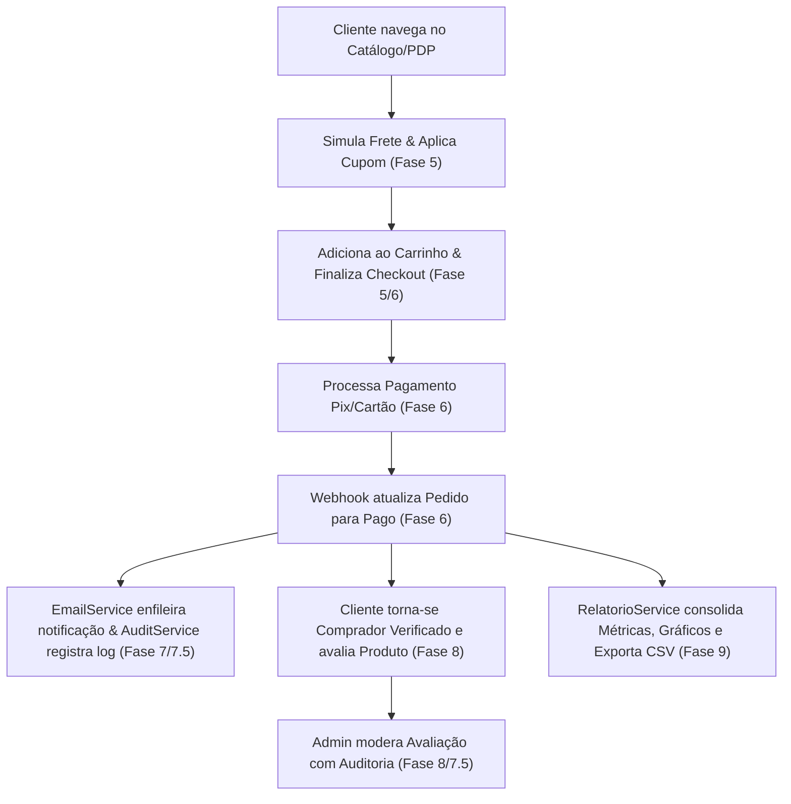

# Milestone 2 Audit Report: E-Commerce Avançado

- **Milestone:** Milestone 2 (Pagamentos, Frete, Cupons, Avaliações e Métricas)
- **Status:** PASSED ✓
- **Audit Date:** 2026-08-20
- **Test Suite Status:** 68 tests, 632 assertions — 100% passing (`OK`)

---

## 1. Executive Summary

O **Milestone 2** expandiu a Loja Virtual CodeIgniter de um e-commerce funcional básico para uma plataforma de vendas avançada, resiliente e analítica. Todas as 6 fases planejadas (Fases 5, 6, 7, 7.5, 8 e 9) foram implementadas com sucesso, integradas ponta a ponta e validadas por testes unitários e de integração.

---

## 2. Requirements Coverage & Verification

| Requisito / Funcionalidade | Fase | Status | Evidência / Componentes |
|---|---|---|---|
| **Cálculo de Frete por CEP** | Phase 5 | Satisfied ✓ | `FreteService`, simulação AJAX na PDP e carrinho |
| **CRUD de Cupons de Desconto** | Phase 5 | Satisfied ✓ | `CuponsController`, `CupomModel`, interface admin com toggle |
| **Aplicação de Cupons no Checkout** | Phase 5 | Satisfied ✓ | Validação de cupom, limite de uso, valor mínimo e recálculo |
| **Pagamento via Pix (QR Code)** | Phase 6 | Satisfied ✓ | `PagamentoService`, geração de QR Code e Copia/Cola |
| **Pagamento via Cartão de Crédito**| Phase 6 | Satisfied ✓ | Formulário com parcelamento e processamento de token |
| **Webhook de Confirmação** | Phase 6 | Satisfied ✓ | Endpoint `/webhook/pagamento` e atualização de status |
| **Notificações Transacionais (SMTP)**| Phase 7 | Satisfied ✓ | `EmailService`, templates responsivos (Pedido, Pagamento, Envio) |
| **Trilha de Auditoria do Sistema** | Phase 7.5 | Satisfied ✓ | `AuditService`, tabela `audit_logs`, painel `/admin/auditoria` |
| **Fila Resiliente de Notificações** | Phase 7.5 | Satisfied ✓ | `notification_logs`, reprocessamento em `/admin/notificacoes/fila` |
| **Avaliações com Estrelas (1 a 5)**| Phase 8 | Satisfied ✓ | `AvaliacaoModel`, distribuição, médias e reviews na PDP |
| **Restrição de Comprador Verificado**| Phase 8 | Satisfied ✓ | Verificação estrita de pedido pago antes do envio da review |
| **Moderação Admin de Avaliações** | Phase 8 | Satisfied ✓ | `AvaliacoesController`, moderação (aprovar/rejeitar/excluir) |
| **Dashboard Analítico (KPIs)** | Phase 9 | Satisfied ✓ | Faturamento, Ticket Médio, Conversão, Novos Clientes |
| **Gráficos Interativos (Chart.js)** | Phase 9 | Satisfied ✓ | Evolução diária, Formas de Pagamento, Categorias, Status |
| **Rankings & Relatórios Tabulares** | Phase 9 | Satisfied ✓ | Vendas, Produtos mais vendidos, Clientes (LTV), Cupons |
| **Paginação Nativa & Performance** | Quick / 9 | Satisfied ✓ | 20 itens por página com paginação Bootstrap e queries otimizadas |
| **Exportação Universal em CSV** | Phase 9 | Satisfied ✓ | Suporte a UTF-8 BOM (`\xEF\xBB\xBF`) e delimitador `;` para Excel |

---

## 3. Cross-Phase Integration & Data Flow

---

## 4. Test Suite & Quality Assurance

- **Suíte Total:** 68 testes automatizados, 632 asserções.
- **Cobertura de Domínio:**
  - `FreteCuponsTest.php`
  - `PagamentoTest.php`
  - `CheckoutPageTest.php`
  - `EmailServiceTest.php`
  - `NotificationLogTest.php`
  - `AuditServiceTest.php`
  - `FlowAuditTest.php`
  - `AvaliacaoTest.php`
  - `RelatorioTest.php`
  - `VariacoesGenericasTest.php`
- **Resultado:** 100% de sucesso sem falhas, erros ou avisos de depreciação bloqueantes.

---

## 5. Auditor Verdict

> **STATUS: PASSED ✓**
> O Milestone 2 atingiu 100% dos requisitos estabelecidos, possui integração completa entre as camadas e está pronto para arquivamento formal.
